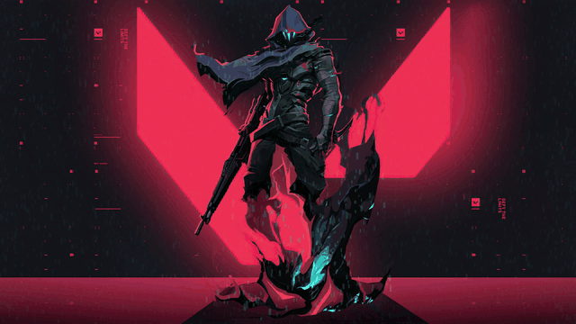
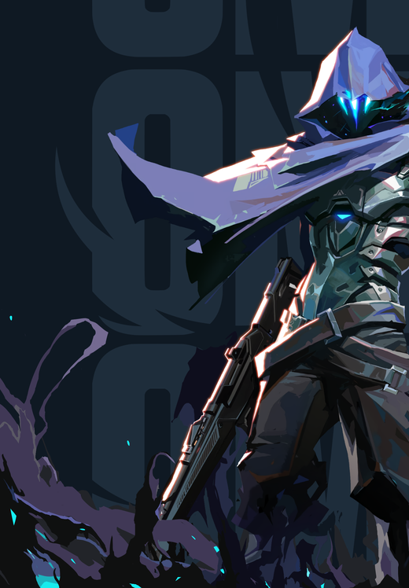

 

 

**`B.TECH CSE`** &nbsp;·&nbsp; **`POORNIMA UNIVERSITY, JAIPUR`** &nbsp;·&nbsp; **`2024 – 2028`** &nbsp;·&nbsp; **`ROBOTICS SPECIALIZATION`**

Full-stack developer building production-grade web applications with React.js, Java, and Python — with a parallel focus on robotics, systems programming, and interactive 3D/game development.

 

---

## About Me

- 🎓 B.Tech Computer Science Engineering student with a robotics specialization
- 💼 Full-Stack Developer Intern who shipped production-ready features under real deadlines
- ☁️ AWS Student Tech Lead — designed and delivered cloud workshops for 70–80 students at a time
- 🌍 AIESEC Junior Manager — coordinated international exchange programs across 3 countries with a 6-person team
- 🎮 Builds games and interactive 3D experiences on the side using Unity, Godot, and Blender
- 📈 Currently deep in DSA and systems-level prep (C/C++), with early exposure to Python and ROS 2

---

<table>
<tr>
<td width="55%" valign="top">

## Tech Stack

<table>
<tr>
<td width="30%"><strong>Languages</strong></td>
<td>
&nbsp;&nbsp;
&nbsp;&nbsp;
&nbsp;&nbsp;
&nbsp;&nbsp;

</td>
</tr>
<tr>
<td><strong>Frontend</strong></td>
<td>
&nbsp;&nbsp;
&nbsp;&nbsp;

</td>
</tr>
<tr>
<td><strong>Backend & Databases</strong></td>
<td>
&nbsp;&nbsp;
&nbsp;&nbsp;
&nbsp;&nbsp;
&nbsp;&nbsp;
&nbsp;&nbsp;

</td>
</tr>
<tr>
<td><strong>Game Dev & 3D</strong></td>
<td>
&nbsp;&nbsp;
&nbsp;&nbsp;

</td>
</tr>
<tr>
<td><strong>Tools & Platforms</strong></td>
<td>
&nbsp;&nbsp;
&nbsp;&nbsp;
&nbsp;&nbsp;

</td>
</tr>
</table>

 

**Currently Focused On**

<table>
<tr>
<td width="30%">🚀 Building</td>
<td>AI Ripple — resource-matching platform (Redrob AI Ideathon)</td>
</tr>
<tr>
<td>📚 Learning</td>
<td>DSA in Python</td>
</tr>
</table>

</td>
<td width="45%" valign="top" align="left">

 

*"Build the thing that doesn't exist yet — then make it run at 60 FPS."*

</td>
</tr>
</table>

---

## GitHub Stats

---

## LeetCode

---

## Experience

**Full Stack Developer Intern** &nbsp;·&nbsp; Future Interns &nbsp;·&nbsp; *May – Jun 2025*
- Built production-ready full-stack applications using React.js, REST APIs, and responsive design principles
- Delivered under real deadlines · Completed with a Letter of Recommendation · Full Stack Certified

**AWS Student Tech Lead** &nbsp;·&nbsp; Poornima University &nbsp;·&nbsp; *Feb 2026 – Present*
- Designed and delivered an AWS fundamentals workshop reaching 70–80 students in a single session
- Architected a hands-on cloud curriculum covering core AWS services and deployment workflows

**AIESEC Junior Manager** &nbsp;·&nbsp; International &nbsp;·&nbsp; *Dec 2025 – May 2026*
- Managed international youth exchange programs spanning 3 countries simultaneously
- Led and coordinated a team of 6 across cross-cultural program logistics

---

## Certifications

&nbsp;

&nbsp;

---

## Connect

&nbsp;

&nbsp;

&nbsp;

  
  

###

---

## Contribution Activity

